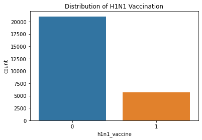

# dsc-machine-learning-project
# H1N1 Vaccine Analysis
## Predicting H1N1 Vaccine Uptake Using Machine Learning
[]!(Images/VaccineH1N1.jpeg)

## Project Overview

During the H1N1 influenza outbreak, vaccines were made available to help control the spread of the disease. However, many individuals did not receive the vaccine due to factors such as vaccine hesitancy, lack of awareness, and limited access to healthcare services. For public health organizations, identifying populations that are less likely to get vaccinated is critical for designing effective intervention strategies.

This project uses machine learning classification models to predict whether an individual received the H1N1 vaccine based on demographic information, health behaviors, and opinions about vaccines. By identifying patterns in the data, the model provides insights that can help public health organizations improve vaccination campaigns and allocate healthcare resources more effectively.

---

## Business Problem

Public health agencies often struggle to determine which populations are less likely to receive vaccinations during disease outbreaks. Without this information, vaccination campaigns may fail to reach the most hesitant or vulnerable populations, and healthcare resources may not be distributed efficiently.

Understanding the factors that influence vaccination decisions can help policymakers and healthcare providers design targeted interventions that increase vaccine uptake and reduce the spread of infectious diseases.

---

## Project Objectives

The main objectives of this project are:

* Build a classification model to predict whether an individual received the H1N1 vaccine.
* Evaluate model performance using metrics such as accuracy, precision, recall, F1-score, and ROC-AUC.
* Identify the most important factors influencing vaccination decisions.
* Provide insights that can help public health organizations design more effective vaccination campaigns.
* Support policymakers and healthcare providers in improving vaccination coverage.

---

## Business Questions

This project aims to answer the following questions:

1. Can we accurately predict whether an individual will receive the H1N1 vaccine using demographic, behavioral, and opinion data?
2. Which demographic and health-related factors most strongly influence vaccination decisions?
3. How do perceptions of vaccine safety, effectiveness, and personal risk affect vaccination behavior?
4. How well do different machine learning models perform in predicting vaccination uptake?
5. What insights from the model can help improve vaccination campaigns and increase vaccine coverage?

---

## Dataset

The dataset used in this project comes from a public health survey conducted during the H1N1 pandemic. It contains information about respondents' demographics, health status, behaviors, and opinions about vaccines.

The target variable is:

**h1n1_vaccine**

* 1 = Respondent received the H1N1 vaccine
* 0 = Respondent did not receive the vaccine

Other features include demographic information, health conditions, healthcare access, and perceptions about vaccine safety and effectiveness.

---

## Methodology

### 1. Data Preparation

The dataset was cleaned and prepared for machine learning by handling missing values, removing unnecessary columns, and separating the target variable from the feature variables.

### 2. Exploratory Data Analysis

Exploratory data analysis was conducted to understand patterns within the data and examine relationships between variables that may influence vaccination decisions.

### 3. Train-Test Split

The dataset was divided into training and testing sets to evaluate how well the models perform on unseen data.

### 4. Feature Scaling

Numerical features were standardized to ensure that all variables were on a similar scale, improving model performance.

### 5. Model Development

Several classification models were trained and evaluated, including:

* Logistic Regression
* Decision Tree Classifier
* Random Forest Classifier
* Gradient Boosting Classifier

Using multiple models allowed for comparison to determine which algorithm performed best for the prediction task.

### 6. Model Evaluation

Models were evaluated using the following metrics:

* Accuracy
* Precision
* Recall
* F1 Score
* ROC-AUC
* Confusion Matrix

ROC curves were also used to visually compare model performance.

---

## Results

After comparing the models, the **Gradient Boosting Classifier** demonstrated the strongest overall performance. It achieved high accuracy and a strong ROC-AUC score, indicating a good ability to distinguish between individuals who received the vaccine and those who did not.

The analysis also highlighted that individuals' perceptions of vaccine safety, effectiveness, and personal health risk play an important role in vaccination decisions.

---

## Recommendations

Based on the results, the Gradient Boosting model is recommended for predicting H1N1 vaccination likelihood. Public health organizations can use insights from the model to identify groups that may be hesitant to receive vaccines.

Targeted awareness campaigns can then be designed to address misconceptions about vaccine safety and effectiveness while improving access to vaccination services. By focusing resources on populations that are less likely to get vaccinated, healthcare providers can improve vaccine coverage and reduce the spread of infectious diseases.

---

## Limitations

Although the model performs well, several limitations should be considered:

* The dataset is based on survey responses, which may contain biases or inaccurate self-reported information.
* The model only reflects the variables available in the dataset, meaning other real-world factors influencing vaccination decisions may not be captured.
* Model performance may vary when applied to different populations or future outbreaks.

---

## Future Improvements

Future work could improve the model by:

* Incorporating additional data sources
* Performing more extensive feature engineering
* Testing additional machine learning models
* Conducting deeper hyperparameter tuning

These improvements could lead to even more accurate predictions and stronger insights for public health decision-making.

---

## Conclusion

This project demonstrates how machine learning can be used to predict vaccination behavior and support public health decision-making. By identifying factors that influence vaccination uptake, healthcare organizations can develop more targeted strategies to improve vaccination rates and better respond to future public health crises.

The **feature variables** consist of all the other relevant columns that may influence vaccination behavior. These variables include demographic information, health behaviors, and opinions about vaccines.

Some columns are removed when creating the feature dataset:
- The column h1n1_vaccine is separated from the dataset to create the target variable (y), since it represents the outcome we want to predict. It is then removed from the feature dataset (X) to prevent the model from using the answer during training.

- seasonal_vaccine is removed to avoid potential data leakage since it is another vaccination outcome.
- respondent_id is removed because it is only a unique identifier and does not contribute meaningful information for prediction.

After separating the dataset into features (X) and the target variable (y), we print the shapes of both datasets to confirm the number of observations and variables being used in the modeling process.
